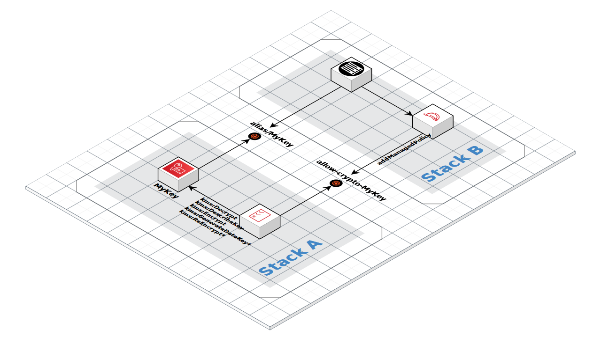

# Usage of AWS KMS Key

Encryption **in transit** and **at rest** are best practices to deal with sensitive data. Software engineers are responsible to protect data with strong encryption at storages. Cloud Services offers a rich variety of products to deal with it - [AWS Key Management](https://aws.amazon.com/kms/) is a great example. It implements a centralized control over the cryptographic keys and integrates with other AWS services to encrypt data.

𝗖𝟯 library hardens customer managed symmetric keys according to best practices and well-known security controls. Especially it focuses on [CIS](https://www.cisecurity.org) controls. The component `c3.kms.SymmetricKey` takes care about:
* key rotation
* delete protection
* access control via KMS/IAM polices



## Facilitate Key Rotation with Aliases

Key **alias** is an important key rotation enabler. The alias acts as DNS CNAME. It abstracts application away from key ID or ARN, which are specific to account or region. The alias facilitates transparent key replacement independently of account, region, rotation schedule or response on security incident. The component creates KMS key and alias simultaneously:

```typescript
// Component creates
//  * kms.Key
//  * kms.Alias with a name of the key (e.g. alias/MyKey)
new c3.kms.SymmetricKey(stack, 'MyKey')
```

Later an application can refer to any alias just using its name

```typescript
c3.kms.fromAlias(stack, 'alias/MyKey')
```

Keep in-mind, that the library enables yearly rotation got your keys. The rotation is managed by AWS and requires no actions from you. It creates a new symmetric key under-the-hood when it is due for rotation. This new key is actively used for all new requests to protect information. The old key remains available to decrypt any existing ciphertext. This process is transparent to key user. Sometimes, yearly rotation is not enough. The key aliases allows you to implement a frequent rotation schedule. Similarly to AWS managed rotation you can substitute a key behind an alias at any point of time. 𝗖𝟯 prioritize the alias usage over key ARN. It **requires** usage of `kms.IAlias` across the library components. The [KMS Alias](https://docs.aws.amazon.com/kms/latest/developerguide/programming-aliases.html) is used intentionally to allow flexibility on key management.


## Control access through IAM 

CMK and IAM policies are a framework to grant access for usage of keys. The default policy enables the root user in the account and allows to attach IAM policies. For each symmetric key, the library creates managed policies to enforce least privilege. Your application can re-use one of the following policy:
* `allow-encrypt-MyKey` allows only encrypt data with the key
* `allow-decrypt-MyKey` allows only decrypt data with the key
* `allow-crypto-MyKey` allows both encrypt/decrypt data

You can re-use the policy with

```typescript
const role = new iam.Role(scope, 'MyRole', /* ... */)
role.addManagedPolicy(
  iam.ManagedPolicy.fromManagedPolicyName(scope, 'ReUse', `allow-crypto-MyKey`)
)
```

It’s also possible to constrain a CMK usage to specific AWS service through the use of the `kms:ViaService` conditional statement within the CMK key policy.

One of the best practices is a definition of at least one CMK key per data classification level. For example, you could define a key for data classified as "company confidential", "user private", "logging" and etc. This helps you to scope down access policy to the key and hence the data to users/services who really need a data for their job. It is possible to have a centrally managed shared key but it limits your ability to control permissions. We found it is easy creating KMS keys within each account and use IAM policy to grant access to the specific CMKs.


## Protect Keys

The loss of encryption key is equal to loss of data. No one is able to decrypt data if corresponding CMK has been deleted. Once a CMK is deleted, it's existence is permanently wiped out. AWS does not have any ability to recover it. To prevent accidental removal of the key, AWS enforces delayed removal policy up to 30 days.
In addition, the policy `cdk.RemovalPolicy.RETAIN` is enforced on each key created with this library. It protects keys even if the corresponding stack is removed.

As an application developer you have to decouple key management and usage to different stacks. The life-cycle of a key is longer than a life-cycle of application. 𝗖𝟯 library provides managed policies and key aliases for developers to protect a key from removal by mistake.


## Conclusion

It is a responsibility of software engineers to retain confidentiality of sensitive data in they applications. The usage of cloud service offers a variety of products to deal with data encryptions, which works transparently inside cloud services. This library facilitates engineers with additional best practices and well-known security controls on crypto key management. You can find more about KMS hint and tips from [AWS White Paper](https://d0.awsstatic.com/whitepapers/aws-kms-best-practices.pdf).


## References

* [AWS Key Management Service Best Practices](https://aws.amazon.com/blogs/security/new-whitepaper-available-aws-key-management-service-best-practices/)

